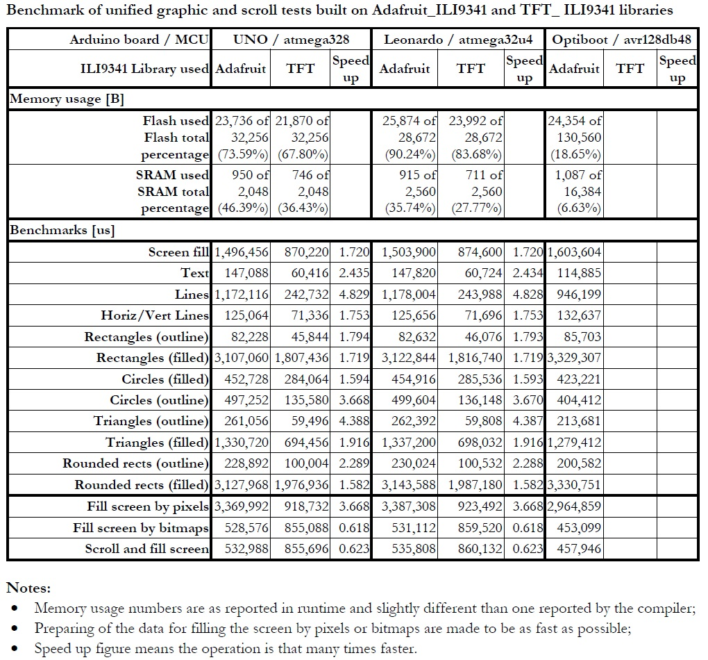

# Unified ILI9341 Graphic Test

This is modified Adafruit original graphic test intended to run on Arduino UNO (ATMega328), Leonardo (ATMega32u4) and Optiboot (avr128db48) boards and measure performance of both Adafruit\_ILI9341 and TFT\_ILI9341 libraries.

**Unfortunately, it is impossible to compile the sketch for Arduino Optiboot (avr128db48) in case of using TFT\_ILI9341 library**

The main modifications in the sketch are:

 * defining of pins for all MCUs - this part has to be also added to User_Setup.h of TFT\_ILI9341 library
 * Massive modification of `testText` function because of lack of `print` and `println` functions in TFT\_ILI9341 library  
 * adding 2 more tests for filling of screen by pixels and bitmaps
 * adding a test for moving the screen by 1 pixel row and filling the free one

It was added following functions like in Adafruit\_ILI9341 library for compatibility:

 * `void setScrollMargins(uint16_t top, uint16_t bottom)`
 * `void scrollTo(uint16_t y)`
 * `void drawBitmap(int16_t x, int16_t y, uint16_t *bitmap, int16_t w, int16_t h)`

Moving and filling are made by `drawBitmap` for Adafruit and `fastPixel` for TFT functions:

    #ifdef 	 defined(LIB_TFT_ILI9341) && !defined(__AVR_AVR128DB64__) &&\
			!defined(__AVR_AVR128DB48__) && !defined(__AVR_AVR128DB32__)
	void drawBitmap(int16_t x, int16_t y, uint16_t *bitmap, int16_t w, int16_t h) {
	  int16_t i, j;
	  tft.fastSetup();
	  for (j = 0; j < h; j++) {
	    for (i = 0; i < w; i++ ) {
	      tft.fastPixel(x + i, y + j, bitmap[i + j * ILI9341_TFTWIDTH]);
	    }
	  }
	}
	#endif

 	int y = 1;
	void loop() {
	#ifdef LIB_Adafruit_ILI9341
 	  uint16_t data[240];
	  tft.scrollTo(y);
	  for (uint8_t x = 0; x < ILI9341_TFTWIDTH; x++) {
	    data[x] = y + x << 5;
	  }
	  tft.drawRGBBitmap(0, y, data, ILI9341_TFTWIDTH, 1);
	#elif defined(LIB_TFT_ILI9341)
	  scrollTo(y);
	  for (uint8_t x = 0; x < ILI9341_TFTWIDTH; x++) {
	    tft.fastPixel(x, y, y + x << 5);
	  }
	#else
	#endif
	  y++;
	  if (y >= ILI9341_TFTHEIGHT) {
	    // full screen is scrolled
	    y = 0;
	  }
	}

Compatibility issues encountered for TFT\_ILI9341 library:

 * The library is not compatible with AVRxxxDBxx MCUs;
 * Lack of `print` and `println` functions witch is very helpful for printing the texts;
 * Lack of `setScrollMargins`, `scrollTo` and `drawBitmap` from buffer important for scrolling of screen.

**Benchmark of unified graphic and scroll tests built on Adafruit_ILI9341 and TFT_ ILI9341 libraries:**

**Notes:**

 * Memory usage numbers are as reported in run-time and slightly different than one reported by the compiler;
 * Preparing of the data for filling the screen by pixels or bitmaps are made to be as fast as possible;
 * Speed up figure means the operation is that many times faster.

Performance issues encountered for TFT\_ILI9341 library: 

 * for Arduino UNO (ATMega328) and Leonardo (ATMega32u4) "Fill screen by bitmaps" is 1.6 times slower than Adafruit_ILI9341 library and approximately 2 time slower than than Adafruit_ILI9341 for avr128db48;
 * for Arduino Optiboot / avr128db48 "Fill screen by pixels" is more than 3 times slower than for other 2 MCUs.

Helpful information about the hardware and software setup is written in 'Unified_ili9340_Graphic_Test_Results' `docx` and `pdf` files:

 * Details for using avr128db48 boards in Arduino IDE;   
 * Self made avr128db48 board based on 48 pin QFP breakout board;
 * Interconnecting of ILI9341 TFT SPI display to different boards;
 * Final results from Unified ILI9341 Graphic Test.

In addition set of `txt`, `xlsx` and `docx` files are added for processing of test results. 

Have fun!
